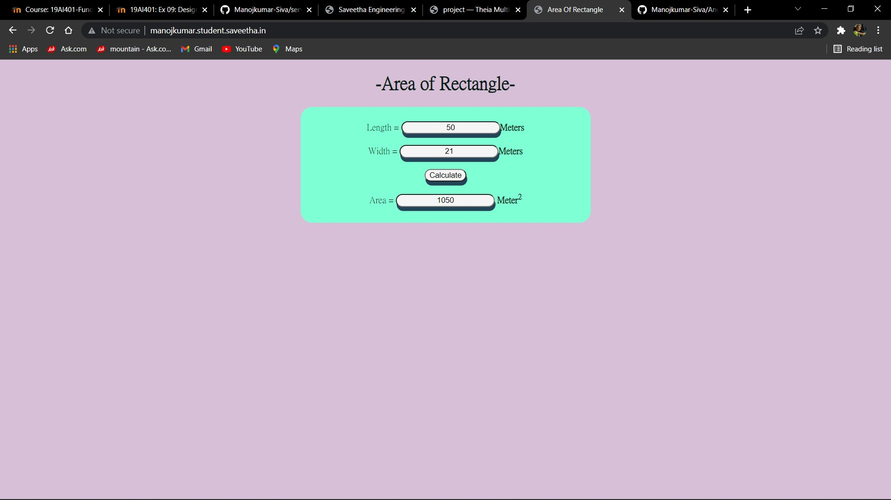

# Design a Website for Server Side Processing

## AIM:
To design a website to perform mathematical calculations in server side.

## DESIGN STEPS:

### Step 1:
Create a django project inside the pulled GitHub Repo.


### Step 2:
Insdie the project create a app called mathapp using command "sudo python3 manage.py startapp mathapp".


### Step 3:
Create a template folder inside mathapp and inside than create another folder called mathapp and inside that create a new file "area.html"


### Step 4:
Add the html conents in the area.html.


### Step 5:
Do the mathemical calculation in views.py and link the html tags ,Link the html file through views.py in urls.py.


### Step 6:

Publish the website in the given URL : http://manojkumar.student.saveetha.in/

## PROGRAM :
Area.html :
```
<!DOCTYPE html>
<html>
<head>
    <meta charset='utf-8'>
    <meta http-equiv='X-UA-Compatible' content='IE=edge'>
    <title>Area Of Rectangle</title>
    <meta name='viewport' content='width=device-width, initial-scale=1'>
    <style>
        body{
            text-align: center;
            background-color:thistle;
            color: #081c15;
        }
        .container{
            display: block;
            background-color:aquamarine;
            text-align: center;
            border-radius: 20px;
            width: 500px;
            height: 200px;
            margin-left: auto;
            margin-right: auto;
        }
        form{
            padding-top: 25px;
        }
        input{
            text-align: center;
            border-radius: 20px;
            text-align: center;
            box-shadow: 1.5px 7px #234356;
            background-color:whitesmoke;
        }
    </style>
</head>
<body>
    <h1>-Area of Rectangle-</h1>
    <div class="container">
        <form method="POST">
             
            Length = <input type="text" name="length" value="{{l}}"><b>Meters</b> <br/>
            <br/>
            Width = <input type="text" name="width" value="{{w}}"><b>Meters</b><br/>
            <br/>
            <input type="submit" value="Calculate"><br/>
            <br/>
            Area = <input type="text" name="area" value="{{area}}"> <b>Meter</b><sup><b>2</b> </sup><br/>
        </form>
    </div>
</body>
</html>
```
urls.py :
```
"""calculations URL Configuration

The `urlpatterns` list routes URLs to views. For more information please see:
    https://docs.djangoproject.com/en/3.1/topics/http/urls/
Examples:
Function views
    1. Add an import:  from my_app import views
    2. Add a URL to urlpatterns:  path('', views.home, name='home')
Class-based views
    1. Add an import:  from other_app.views import Home
    2. Add a URL to urlpatterns:  path('', Home.as_view(), name='home')
Including another URLconf
    1. Import the include() function: from django.urls import include, path
    2. Add a URL to urlpatterns:  path('blog/', include('blog.urls'))
"""

from django.contrib import admin
from django.urls import path
from mathapp import views

urlpatterns = [
    path('admin/', admin.site.urls),
    path("areaofrectangle/",views.areacalculation,name="areaofrectangle"),
    #The below line is to display the html page on our site without /staic/areaofreactangle.
    path("",views.areacalculation,name="areaofrectangleroot")
]

```
views.py :
```
from django.shortcuts import render

def areacalculation(request):
    context = {}
    context["area"] = "0"
    context["l"] = "0"
    context["w"] = "0"
    if request.method == "POST":
        l= request.POST.get("length","0")
        w = request.POST.get("width","0")
        area = ((int(l) * int(w)))
        context["area"]= area
        context["l"] = l
        context["w"] = w
    return render(request,"mathapp/area.html",context)

```
## OUTPUT:




## Result:
Thus a website is designed to perform mathematical calculations in server side and is hosted at : http://manojkumar.student.saveetha.in/

